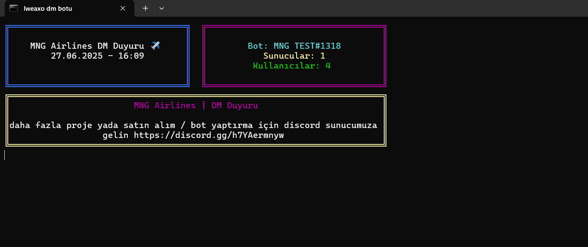
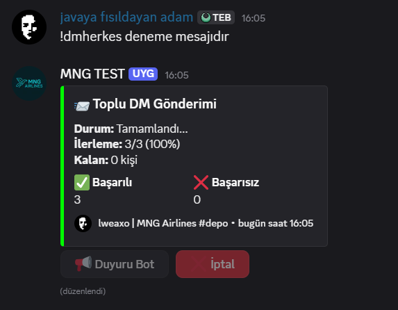

# 📢 **MNG Airlines DM Duyuru Botu**  
**Discord sunucunuzdaki kullanıcılara toplu DM gönderimi yapan profesyonel bir bot.**  



---

## ✨ **Özellikler**  
- ✅ **Hedefli DM Gönderimi**: Belirli kullanıcılara veya tüm sunucuya mesaj iletme.  
- 📊 **Gerçek Zamanlı İstatistikler**: Başarılı/başarısız gönderimlerin takibi.  
- ⚡ **Rate Limit Yönetimi**: Otomatik gecikmelerle Discord limitlerini aşmadan çalışır.  
- 📝 **Detaylı Log Kaydı**: Tüm gönderimlerin txt dosyasına kaydedilmesi.  

---

## 📸 **Ekran Görüntüleri**  
| **DM Gönderim Arayüzü** | **Yardım Komutu** |
|------------------------|------------------|
|  |  |

---

## ⚙️ **Kurulum**  
1. **Gereksinimler:**  
   ```bash
   Node.js v18+
   Discord.js v14
   ```

2. **Adımlar:**  
   ```bash
   npm install
   ```

3. **Ayarlar:**  
   `config.json` dosyasını düzenleyin:  
   ```json
   {
     "token": "DISCORD_BOT_TOKENINIZ",
     "ownerID": "YONETICI_DISCORD_ID",
     "rateLimitDelay": 2500,
     "prefix": "PREFIX"
   }
   ```

4. **Başlatma:**  
   ```bash
   node index.js
   ```

---

## 🛠 **Komutlar**  
| Komut | Açıklama | Örnek |
|-------|----------|-------|
| `!dm <mesaj>` | Etiketlenen kullanıcıya DM gönderir | `!dm @kullanici Merhaba!` |
| `!dmherkes <mesaj>` | Sunucudaki tüm üyelere DM gönderir | `!dmherkes Yeni duyuru!` |
| `!yardım` | Komut listesini gösterir | `!yardım` |

---

## 📜 **Lisans**  
MIT Lisansı - Detaylar için [LICENSE](LICENSE) dosyasını inceleyin.  

---

## 🌍 **Destek & İletişim**  
Bot özelleştirme veya satın alma için:  
[](https://discord.gg/h7YAermnyw)  

---

### 🔍 **Notlar**  
- Botu çalıştırmadan önce `config.json` dosyasını doldurmayı unutmayın.  
- Rate Limit hatası alırsanız, `rateLimitDelay` değerini artırın.  